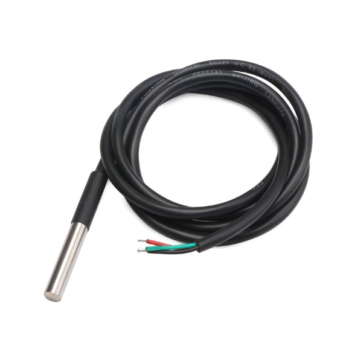
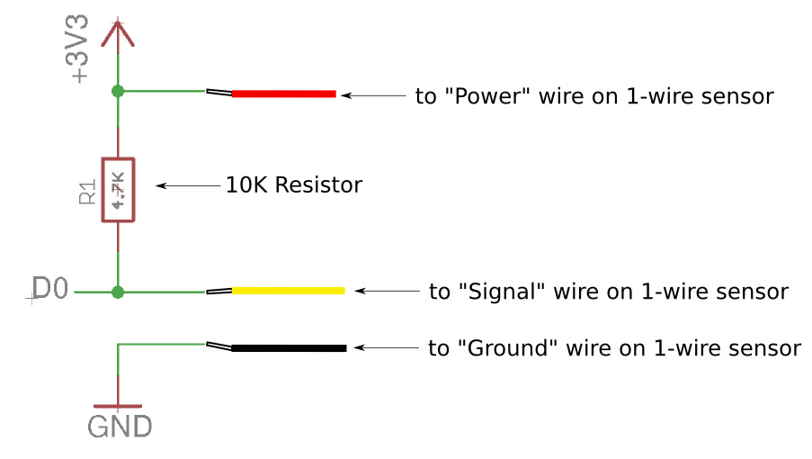
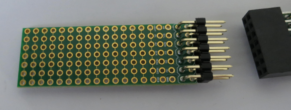
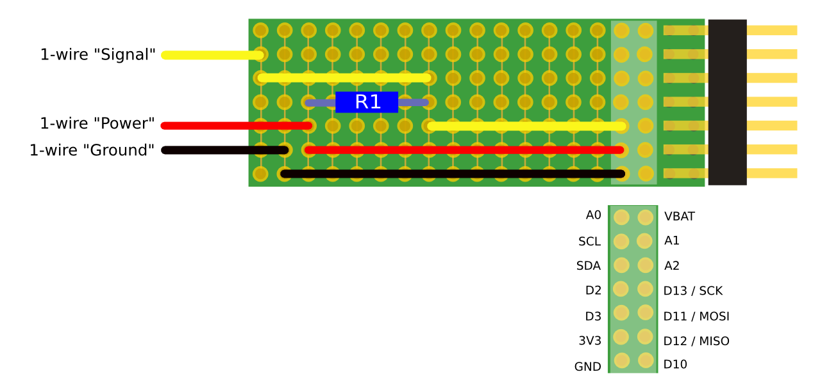

# Measuring temperature using an 1-wire temperature sensor using a Riffle

**Note**: If this is your first time programming a Riffle, you'll probably want to check out the [Riffle: Getting Started instructions](https://github.com/dwblair/Riffle-Getting-Started), which will show you how to set up the Arduino IDE and the Riffle for programming and datalogging.

## 1-wire basics

The [1-wire](https://en.wikipedia.org/wiki/1-Wire) protocol allows for sensor readings to be retrieved using only a single signal line, along with power and ground lines.  Some 1-wire sensor variants also allow the signal line to serve as the power line, reducing the number of needed signal lines to two. It is a bus protocol, allowing more than one device to be connected in parallel; every 1-wire sensor has a unique identifier, so many can be placed on the same bus, spanning several meters of wire length. 

1-wire devices require that specialized code be loaded onto an Arduino or Riffle in order to allow for sensor readings.  Usually this is accomplished by loading a dedicated 1-wire library onto the microcontroller.  We'll be doing that in the guide below. 

## 1-wire temperature sensors

1-wire temperature sensors are in wide use, as they are simple to use, and the bus configuration allows for many temperature sensors to be used at once, making e.g. distributed temperature measurements over an area.

We'll be using a waterproof version of the DS18B20, a popular 1-wire temperature sensor that comes in several varieties. Any chip or sensor labeled 'DS18B20' should work just as well.  

## 1-wire Circuit

As described above, we'll simply be connecting the 1-wire power and ground lines to the 3.3V and GND lines on the Riffle; we can connect the 1-wire signal line to any digital pin.

For 1-wire bus systems on 3.3V microcontrollers, a 4.7K 'pullup resistor' is required on the signal line -- i.e., we need to connect  the signal line to 3.3V via a 4.7K resistor.

## 1-wire Sensor on a Riffle Protoboard

The Riffle protoboard connects to the end of the Riffle, making it easier to connect sensor wires to the Riffle in a secure fashion:

You can see how to connect a 1-wire sensor to a Riffle protoboard below.  We've chosen D3 as the Riffle pin on which we'll be reading the 1-wire signal line:

## Code for 1-wire Temperature Sensor Datalogging with a Riffle

Now that you've set up the circuit, here's how to get a Riffle logging 1-wire temperature values to a microSD card:

1. Download this entire repository using the button on this page above (or [this link](https://github.com/dwblair/riffle-one-wire/archive/master.zip) should work).  

2. Copy all of the libraries labeled in the "libraries" folder to the "libraries" folder in your Arduino IDE "sketchbook" folder.

3. Then, upload the "riffle_one_wire.ino" code onto the Riffle, choosing "Arduino UNO" as the board type. 

This code will start measuring temperature using a 1-wire sensor as setup above.  It assumes that the 1-wire sensor signal line is connected to D3, but this can be changed in the code if another digital pin is used.
 
The data is output in "TSV" format, with tabs separating columns of data (timestamp in the first column, 1-wire temperature in the third column).

# How you can contribute

Some useful guidelines about the best way to contribute to the project (or to fork it) can be found [here](contributing.md).

# Support and Licensing 

The Riffle_328 project has been supported through [Public Lab](www.publiclab.org)'s Open Water Initiative, and is licensed under [CERN OHL 1.2](LiCENSE.md).

